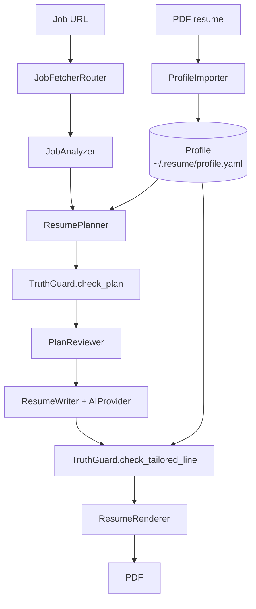

# Architecture

This document explains how resumeOS is built and why, for someone who
didn't write it. It assumes you've read the [README](../README.md)'s
quickstart and project-status table.

## Design principles

These aren't aspirational — they're decisions you can see directly in the
code structure:

1. **The AI proposes, code enforces.** Nothing an LLM produces reaches a
   rendered resume without passing `TruthGuard` first (`app/guard.py`).
2. **Code first, AI last.** Section splitting, item parsing, skill
   extraction, tech tagging — all regex and plain Python. The *only* class
   that's allowed to call an LLM is `ResumeWriter` (`app/ai/writer.py`),
   and only once per job.
3. **Every stage is a class with one job**, taking a data model in and
   returning a data model out (`app/models.py`). That's what makes it
   possible to test `ProfileImporter` without a network connection, or
   `GenericFetcher` without a resume PDF.
4. **Stubs are honest.** A stage that isn't built yet raises
   `NotImplementedError` with a message explaining what's missing, rather
   than silently returning an empty result. If you're debugging and hit
   one, that's the codebase telling you the truth.

## The pipeline, end to end

`app/pipeline.py`'s `ResumePipeline.run()` is the literal code form of this
diagram — it calls each stage in order and passes one stage's output into
the next one's input. Only the left branch (PDF → Profile) is real today;
everything from `JobFetcherRouter` down exists as real interfaces with
mostly-stubbed implementations.

## Data models (`app/models.py`)

Every stage speaks in these types — nothing passes a raw dict between
stages.

- **`Bullet`** — one line of a resume. `id` (e.g. `exp.1.3`), `text`,
  `tech` (which known vocabulary terms it mentions), `numbers` (every
  numeric claim in it — used by the truth guard).
- **`Item`** — one job or project. `id`, `title`, `org`, `dates`,
  `location`, `tech` (explicitly declared, e.g. from a project's tech-list
  line), `bullets`.
- **`EducationEntry`** — school, degree, dates, and freeform detail lines
  (GPA, coursework, etc.) that don't need the same structure as job bullets.
- **`Personal`** — name, email, phone, links.
- **`Profile`** — the whole career profile: `personal`, `summary`,
  `experiences`, `projects`, `education`, `skills`, and `vocabulary` (the
  deduped union of every tech/skill term anywhere in the profile — this is
  what the truth guard checks against). `other_sections` holds anything
  recognized as a heading but not one of the modeled sections (e.g.
  "Awards & Honors") so nothing from the resume is silently thrown away.
- **`JobPosting`, `JobAnalysis`, `ResumePlan`, `TailoredLine`,
  `TailoredResume`, `Generation`** — the shapes the not-yet-built
  fetch/analyze/plan/write/render stages produce. They exist now so the
  stub stages have something real to type-check their signatures against.

## The Import stage, in detail

This is the one piece of the tool that's fully real, so it's worth
understanding well — it's also the best template for how any future stage
should be built.

`app/importing/profile_builder.py`'s `ProfileImporter` is a **facade**: the
one class `cli.py` calls, which internally wires together nine small,
single-purpose classes:

1. **`PdfTextExtractor`** (`text_extraction.py`) — uses `pdfplumber` with
   `x_tolerance=0.5`, not the more obvious `pypdf`. Both `pypdf` and
   `pdfplumber`'s *default* tolerance drop spaces around styled or
   hyperlinked text spans on many resume templates (`"a star schema for"`
   comes out as `"astar schemafor"`). The tight tolerance fixes this.
2. **`LinkAnnotationExtractor`** — separately reads PDF *link annotations*
   (`/Annots` → `/A` → `/URI`) because a resume's visible text often just
   says "LinkedIn" or "GitHub" with the actual URL only present as a
   clickable-link target, invisible to plain text extraction.
3. **`ContactInfoParser`** — regex over the raw text for email/phone/URLs,
   plus the first non-blank line as a best-effort name.
4. **`SectionSplitter`** (`sections.py`) — walks the text line by line,
   matching each line against a table of heading aliases
   (`SECTION_ALIASES`) case-insensitively. Anything before the first
   recognized heading goes into `"header"` (the name/contact block).
5. **`ExperienceItemParser` / `ProjectItemParser`** (`items.py`) — the
   trickiest part of the whole codebase, explained in its own section below.
6. **`SkillsParser`** (`skills.py`) — turns a "Technical Skills" section
   into a flat list, handling multi-line-wrapped categories and
   parenthetical sub-lists like `AWS(S3, ECS, ECR)`.
7. **`EducationParser`** (`education.py`) — splits a degree line's
   trailing date off from the degree name, and folds wrapped detail-bullet
   continuation lines together.
8. **`VocabularyBuilder` / `BulletTechTagger`** (`vocabulary.py`) — once
   skills and items are parsed, the vocabulary is the union of all
   declared tech terms; then every bullet gets tagged with which
   vocabulary terms it actually mentions (longest terms matched first, so
   "React Native" wins over "React").

### Why item parsing is continuation-aware

A naive line-by-line parser treats every non-bullet line as a new item's
header. That's wrong: a bullet that wraps onto a second physical line
looks exactly like that from the parser's point of view. This was a real
bug caught mid-project — it turned 4 real experience entries into 19, because
every wrapped bullet line got misread as a new job.

The fix (`ItemParser` in `items.py`) is a small state machine: a non-bullet
line only starts a new item if it matches a **positive header signal**
(defined per section type via the abstract `_parse_header` method).
Otherwise, it's folded onto whatever came before it — the last bullet's
text if one exists, or the current item's `location` field otherwise.

- **`ExperienceItemParser`** recognizes a header via
  `EXPERIENCE_HEADER_RE`: `"Title @ Org May 2026 – Aug 2026"`.
- **`ProjectItemParser`** recognizes a header via `PROJECT_TECH_RE`: a
  line ending in a link-label + comma-separated tech list, e.g.
  `"My Project § Code Python, PyTorch, AWS"`. **This is the parser's
  biggest known limitation** — it's tuned to a specific resume-builder
  template's link-icon format. A resume whose project entries don't end
  in an inline tech list will have all its projects merged into one.

`EducationParser` uses the same continuation principle with an explicit
`state` field (`"school" → "degree" → "details"`) instead of a header
regex, since education entries don't have as clean a positive signal.

### Why the skills parser checks line starts, not the whole joined text

An earlier version joined every line of the skills section into one string
and used a global regex split on `"Category:"` patterns. That silently
ate the last skill in a category whenever it wasn't comma-terminated and
directly touched the next category's label — e.g. `"...HTML/CSS,
Golang\nFrameworks & Tools:..."` joined into `"...Golang Frameworks &
Tools:..."`, and the regex matched `"Golang Frameworks & Tools"` as one
heading, dropping "Golang" as a skill entirely. This was a real bug found
by the test suite (`tests/unit/test_importing.py`), including on the
maintainer's own resume.

The fix: `SkillsParser` only recognizes a category label at the **start**
of a physical line (`_CATEGORY_LINE_RE.match`, not a global split). A line
without a label at its start is folded onto whichever category came
before it. This matches how resumes are actually formatted and can't
accidentally merge across a line boundary.

## Truth Guard (`app/guard.py`)

`TruthGuard` is deliberately plain Python with no dependencies beyond the
profile it's checking against. Of the design spec's five rules:

- **Implemented and tested:** every ID in a plan exists in the profile
  (`check_plan`), every skill is in the profile's vocabulary
  (`check_skills`), every number in a rewritten bullet appears in its
  source bullet (`check_tailored_line` → `_check_numbers`), and a bullet's
  length limit (`_check_length`).
- **Not implemented:** `check_tech` (every tech term in a rewritten bullet
  must appear in the vocabulary) explicitly raises `NotImplementedError`.
  This is different from `BulletTechTagger`'s job — tagging only needs to
  find *known* vocabulary terms in text, which is easy (search for each
  known term). Guarding needs the reverse: reliably telling which tokens
  in **arbitrary rewritten text** are "tech-looking" at all, so an
  invented one can be flagged. That's a real extraction problem that's
  only worth solving once `ResumeWriter` has a working provider producing
  real rewritten text to test against — building it against nothing would
  just be guessing.

## Swappable AI provider (`app/ai/`)

`AIProvider` is an abstract base class with one method:
`rewrite_bullets(picks) -> list[TailoredLine]`. Three implementations
exist:

- **`NullProvider`** — fully real. Passes every bullet through unchanged.
  This is what powers a future `--no-rewrite` flag: zero LLM calls, by
  construction, not by a special-cased flag check somewhere else.
- **`OllamaProvider`, `GeminiProvider`** — stubs. Constructing one is fine
  (so config/wiring code can be written and tested); calling
  `rewrite_bullets` raises `NotImplementedError`.

`ResumeWriter` wraps a provider with the guard-and-retry logic from the
design spec's failure-handling table: call the provider once, check the
result with the guard, and if it fails, retry once; if it fails again,
fall back to the bullet's original wording rather than dropping it or
shipping something ungrounded. This control flow is real and testable
today with a fake provider, independent of whether any real provider
exists yet.

## Fetching (`app/fetching/`)

`JobFetcher` is an abstract base class with `handles(url)` and `fetch(url)`.
`JobFetcherRouter` tries a list of fetchers in order and uses the first one
whose `handles()` returns `True`, falling back to `GenericFetcher` last
(which always returns `True`).

- **`GenericFetcher`** is fully real: fetches HTML with `httpx` (a
  browser-like User-Agent header, since some sites block obvious bot
  UAs), strips `script`/`style`/`nav`/`header`/`footer` tags with
  BeautifulSoup, and returns the remaining visible text. Tested against
  live URLs in `tests/integration/test_fetching_live.py`. It has no
  JavaScript-rendering fallback (the design spec calls for Playwright
  here eventually) — a JS-only page will come back with thin or empty text.
- **`GreenhouseFetcher`, `LeverFetcher`, `AshbyFetcher`** — `handles()` is
  real (matches on domain), `fetch()` is a stub. This means the router's
  *dispatch logic* is fully testable today (you can confirm a
  `greenhouse.io` URL correctly routes to `GreenhouseFetcher` and *not*
  silently falls through to the generic fetcher) even though no platform
  API integration exists yet.

## Persistence (`app/store.py`)

`ProfileStore` saves/loads `Profile` to `~/.resume/profile.yaml` via
`dataclasses.asdict` + PyYAML, with explicit reconstruction back into
nested dataclasses on load (`_profile_from_dict`, `_item_from_dict`) since
YAML doesn't know how to deserialize a dataclass on its own. Round-tripped
and tested in `tests/unit/test_store.py`.

`CacheStore` (fetched postings, rewritten bullets) and `HistoryStore`
(past generations) are stubs — their constructors and intended file
layout exist, but nothing reads or writes yet.

## How to extend

**Add a new job-board fetcher** (e.g. a real Greenhouse implementation):
implement `JobFetcher.fetch()` in `app/fetching/greenhouse.py` (the class
and `handles()` already exist) and add a test in
`tests/integration/test_fetching_live.py` against a real posting.

**Add a new AI provider**: subclass `AIProvider` in `app/ai/`, implement
`rewrite_bullets`. `ResumeWriter` and `TruthGuard` don't need to change —
that's the point of the interface.

**Implement `TruthGuard.check_tech`**: this is the natural next step once
a real `AIProvider` exists. It needs a way to extract "tech-looking
tokens" from arbitrary rewritten text (not just search for known
vocabulary terms) — worth prototyping against real LLM output rather than
synthetic text, since the failure modes (proper nouns like "GDSC" or
"NASDAQ" being mistaken for invented tech) are easiest to see there.

## Testing strategy

- **`tests/unit/`** — fast, deterministic, no network. Covers path
  resolution, the full import pipeline against a small hand-written
  sample resume (regression-tests every bug found during development —
  wrapped bullets, the awards/education bleed, the skills-parser bug, the
  ResNet18-digit-leak), the truth guard's rules, and profile persistence
  round-trips.
- **`tests/integration/`** — hits real URLs, marked `network` and excluded
  from a plain `pytest` run. Covers `GenericFetcher` against real job
  postings, the router's dispatch logic, and error handling (404,
  unresolvable domain) via `FetchError` rather than an unhandled crash.
